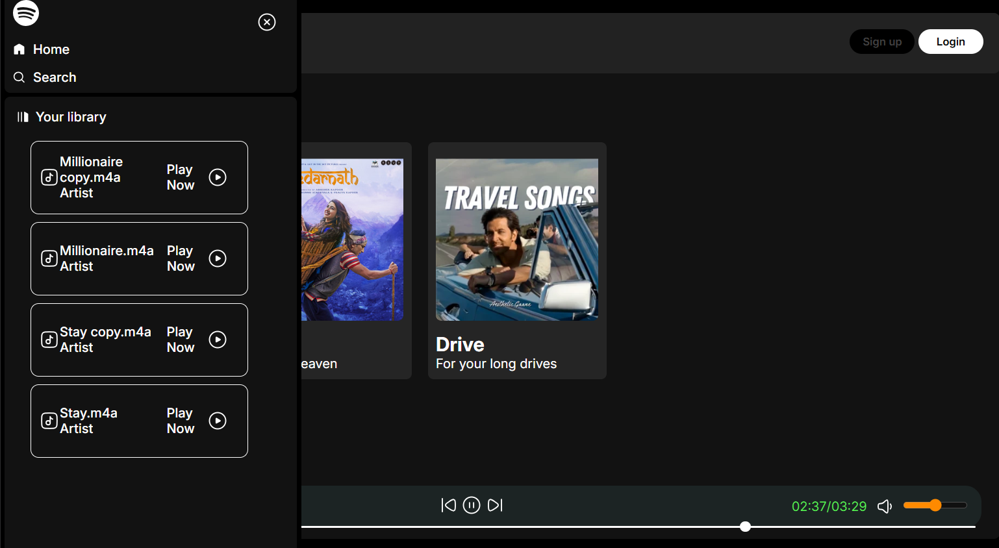
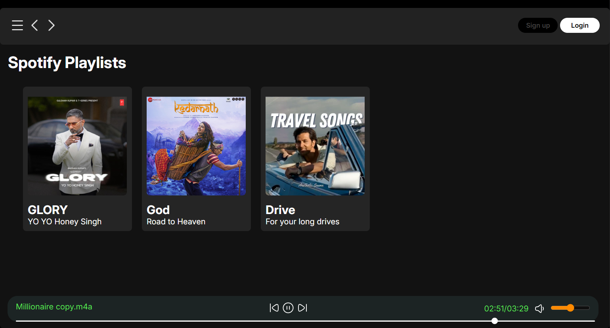

# 🎵 Spotify Clone

A sleek and responsive **Spotify Clone** built using **HTML, CSS, and JavaScript**. Enjoy a music player experience with a modern UI and interactive features. 🎧🚀

## 🔥 Features

✅ **Responsive Design** - Works seamlessly on all screen sizes 📱💻  
✅ **Custom Audio Player** - Play, pause, and skip tracks 🎶  
✅ **Interactive UI** - Smooth animations and hover effects ✨  
✅ **Playlist Support** - Add and remove songs dynamically 📜  
✅ **Dark Mode Theme** - Elegant and easy on the eyes 🌙  

## 🚀 Tech Stack

- **HTML5** - Structure the web pages 🏗️
- **CSS3** - Stylish and modern UI 🎨
- **JavaScript** - Dynamic interactions ⚡

## 📸 Preview
<p align="center">
  
  
  
</p>


## 🛠️ Installation & Usage

1️⃣ Clone this repository:
```bash
git clone https://github.com/yourusername/spotify-clone.git
```

2️⃣ Navigate to the project folder:
```bash
cd spotify-clone
```

3️⃣ Open `index.html` in your favorite browser:
```bash
open index.html  # Mac
start index.html # Windows
gnome-open index.html # Linux
```

## 🎶 How It Works

- Click the **Play** button to start music 🎵
- Use **Next** and **Previous** buttons to switch songs ⏭️⏮️
- Adjust **Volume** using the slider 🔊
- **Dark Mode Toggle** for a better experience 🌑

## 🤝 Contributing

Got an idea? Found a bug? Contributions are welcome! Feel free to **fork** the repo, create a branch, and submit a pull request. 💡🔧

## 📜 License

This project is open-source and available under the **MIT License**.

---

💖 Made with love by [Your Name](https://github.com/yourusername) 🚀

